<div align="center">

# Incident-to-Detection Lab 01

**From attack simulation to validated detection: DFIR timeline, Sigma + SPL rules and alert replay in Splunk**


</div>

---

> **Controlled simulation.** Everything here was executed in an isolated VMware lab owned by the analyst, using Atomic Red Team. This is **not** a real security incident and no real victim data is involved.

> **Privacy.** Host-identifying values (Windows Product ID, DHCP server, IP addresses and the machine SID) are redacted in the screenshots and replaced with `192.168.x.x` in the reports. The VM hostname `DESKTOP-DI2GMCC` is a throwaway lab name and is left as is.

## Overview

The lab starts from a common blue-team gap: the environment **recorded** everything (Sysmon and Windows logs in Splunk) but had **no detection** for the behaviors being tested.

The project closes that gap in four phases:

| Phase | What was done | Output |
|---|---|---|
| 1. Simulate | Ran three ATT&CK techniques with Invoke-AtomicTest | Raw telemetry in Splunk |
| 2. Investigate (DFIR) | Reconstructed the timeline, process chain and IOCs/TTPs | DFIR report + timeline |
| 3. Detect | Built behavior-based rules in SPL and Sigma, tested for false positives | DET-001, DET-002 |
| 4. Validate | Replayed the same techniques and confirmed the alerts fired | Validation report |

## Key Results

| Metric | Value |
|---|---|
| Techniques simulated | 3 (T1082, T1059.001, T1053.005) |
| Detection rules built | 2 (DET-001, DET-002), each in SPL and Sigma |
| Replay validation | **2 of 2 detected** |
| T1082 | Observed, deliberately **no rule** (too noisy on its own, see Detection Package) |
| Evidence | 32 screenshots across 4 phases + 6 reports |

## Lab Environment

| Component | Details |
|---|---|
| Target | Windows 10 Pro (build 19045) VM, standalone workgroup host |
| Hypervisor | VMware Workstation, NAT network |
| Telemetry | Sysmon (Operational), Windows Security, PowerShell Operational (4103/4104) |
| Forwarding | Splunk Universal Forwarder to `index=sysmon` and `index=wineventlog` |
| SIEM | Splunk (scheduled alerts) |
| Simulation | Atomic Red Team (`Invoke-AtomicTest`) |
| Safety | VM snapshot `Clean_Baseline_Before_Scenario1_2026-09-26` used as rollback point |

## MITRE ATT&CK Coverage

| Tactic | Technique | Atomic test | Observed | Rule | Validated |
|---|---|---|---|---|---|
| Discovery | T1082 System Information Discovery | Test 1 | ✅ | ❌ (deliberate) | — |
| Execution | T1059.001 PowerShell | Test 15 | ✅ | ✅ DET-001 | ✅ |
| Persistence / Priv. Esc. | T1053.005 Scheduled Task | Test 4 | ✅ | ✅ DET-002 | ✅ |

---

# Evidence Walkthrough

## Phase 0: Telemetry and tooling setup

Before simulating anything, the logging pipeline was verified end to end.

**Sysmon events arriving in Splunk** (`index=sysmon`)

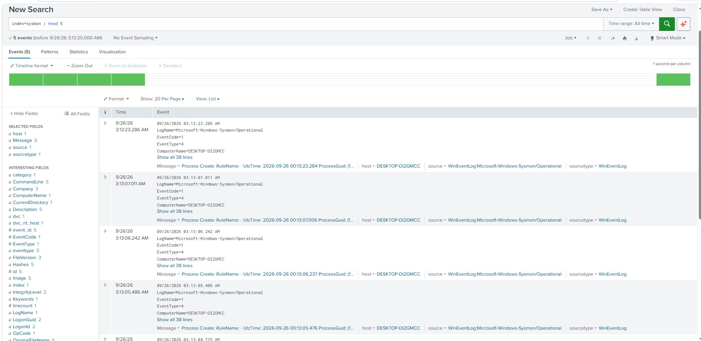

**PowerShell Operational events (4103/4104) arriving in Splunk** (`index=wineventlog`)

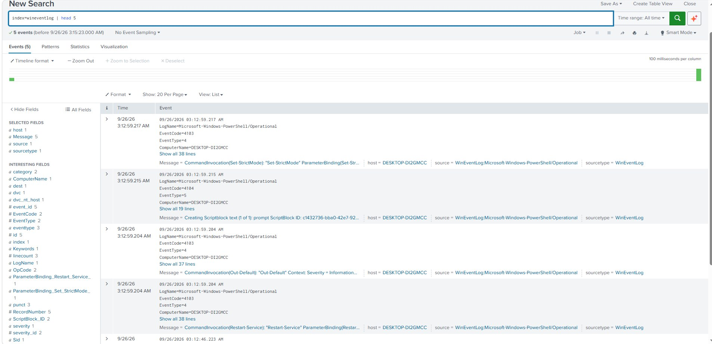

**Atomic Red Team installed**

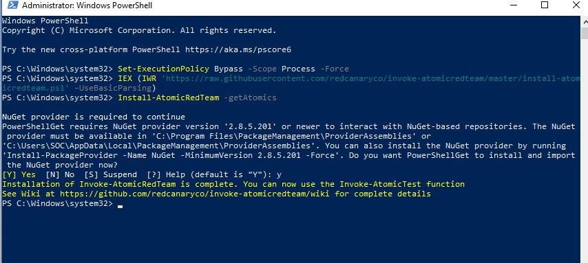

**Defender exclusion for the Atomic Red Team folder** (lab only, so the test files are not removed)

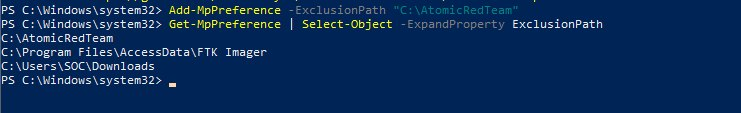

## Phase 1: Attack simulation

### Technique 1: T1082 System Information Discovery

Available T1082 atomics, then Test 1 (`systeminfo` + `reg query ...\Services\Disk\Enum`).

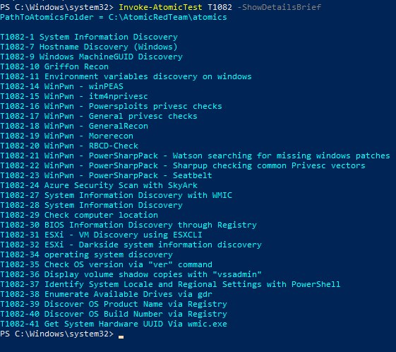

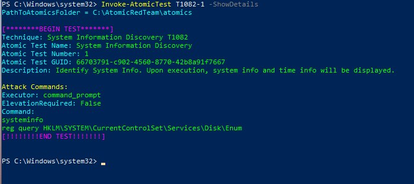

**Execution output**

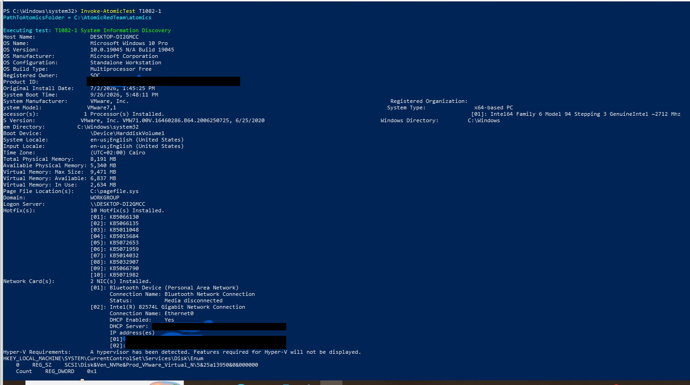

**Detected in Splunk:** the `systeminfo.exe` process creation (Sysmon Event 1)

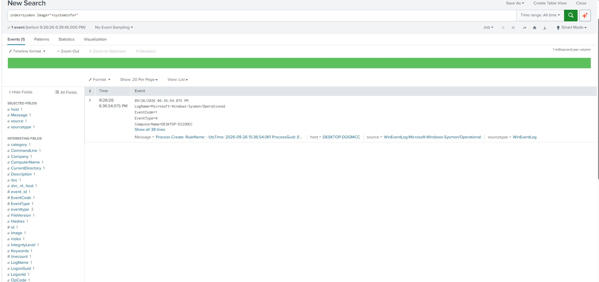

### Technique 2: T1059.001 PowerShell Encoded Command

Test 15 runs `powershell.exe` with variations of the `-EncodedCommand` switch. Prerequisites checked first.

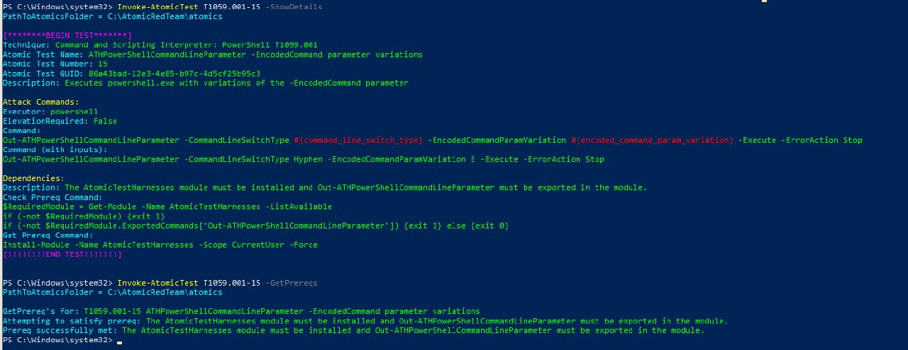

**Execution:** `TestSuccess: True`, `Exit code: 0`

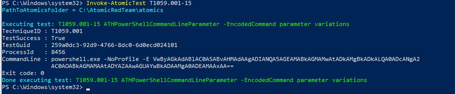

**Detected in Splunk:** the Sysmon event shows `powershell.exe -NoProfile -E <Base64>` spawned by **`WmiPrvSE.exe`** (parent user `NT AUTHORITY\NETWORK SERVICE`), at `IntegrityLevel: High`. A WMI-spawned encoded PowerShell is the behavior worth detecting, not the binary itself.

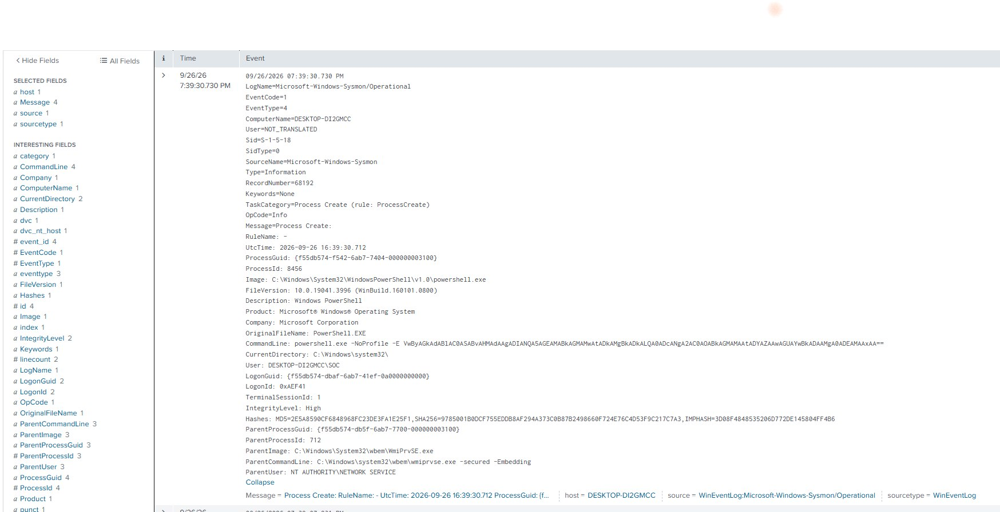

### Technique 3: T1053.005 Scheduled Task

Test 4 registers a task named `AtomicTask` with an **AtLogon** trigger, running `calc.exe` with `-RunLevel Highest` as `BUILTIN\Administrators`.

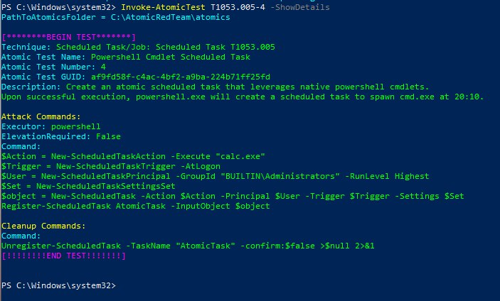

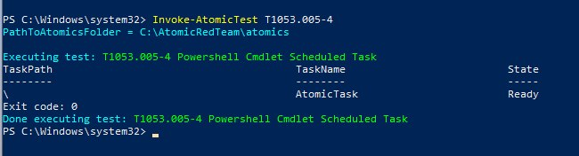

**Detected in Splunk (Sysmon):** the PowerShell command line that registered the task

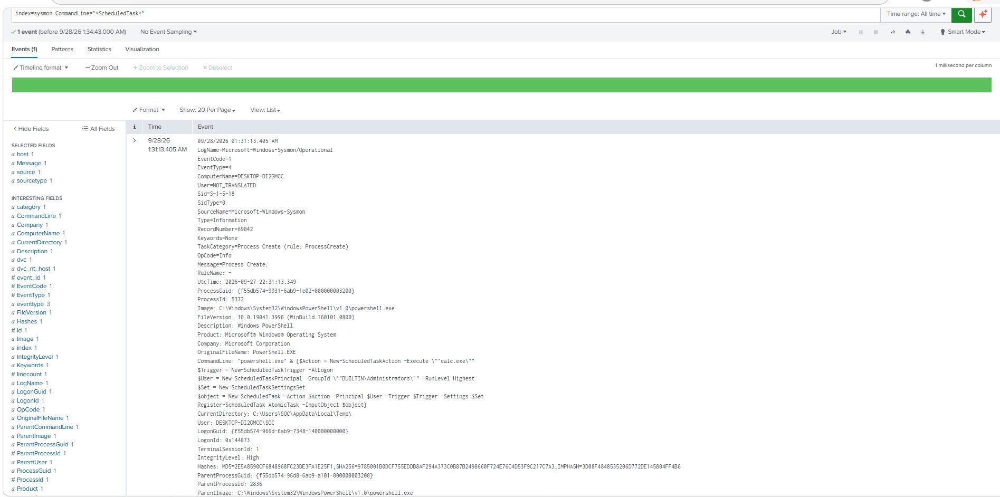

**Detected in Splunk (Security 4698):** the authoritative record, with `LogonTrigger`, `GroupId S-1-5-32-544` and `RunLevel HighestAvailable`. This event only appeared after manually enabling the *Other Object Access Events* audit subcategory, which is **off by default** and is a detection gap on its own.

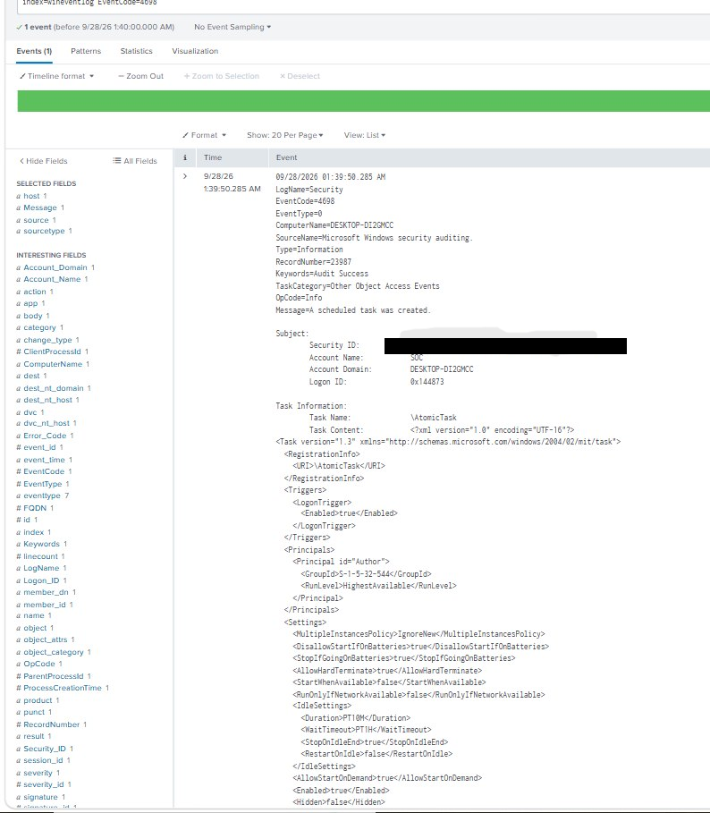

**Cleanup**

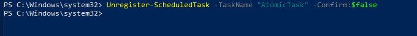

---

## Phase 2: DFIR investigation

A scoped Splunk search reconstructs the whole activity chain for the `SOC` account from Sysmon Event 1.

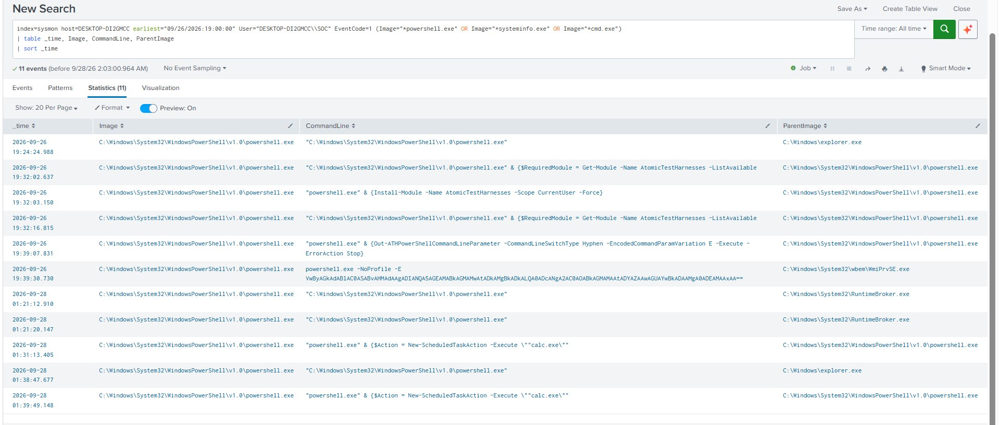

**T1082 process chain:** `powershell.exe` → `cmd.exe` → `systeminfo.exe` and `reg.exe`

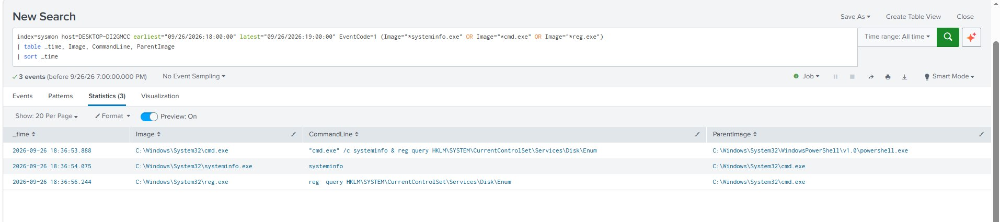

### Reconstructed timeline (Cairo time, UTC+2)

| Time | Source | Event | Parent | Technique |
|---|---|---|---|---|
| 2026-09-26 18:36:53 | Sysmon 1 | `cmd.exe /c systeminfo & reg query ...\Disk\Enum` | powershell.exe | T1082 |
| 2026-09-26 19:39:30 | Sysmon 1 | `powershell.exe -NoProfile -E <Base64>` | **WmiPrvSE.exe** | T1059.001 |
| 2026-09-28 01:39:49 | Sysmon 1 | `AtomicTask` registered | powershell.exe | T1053.005 |
| 2026-09-28 01:39:50 | Security 4698 | Scheduled task created | n/a | T1053.005 |

Full timeline including the validation replay: [`02_DFIR_Investigation/Timeline/Timeline.md`](02_DFIR_Investigation/Timeline/Timeline.md)

### Extracted IOCs and TTPs

| TTP | Reusable behavior |
|---|---|
| T1082 | `cmd.exe /c systeminfo & reg query` pattern |
| T1059.001 | `-e` / `-enc` / `-EncodedCommand` + long Base64, especially with parent `WmiPrvSE.exe` |
| T1053.005 | `LogonTrigger` + `RunLevel HighestAvailable` in Event 4698 |

File and task names (`AtomicTask`, `calc.exe`) are **weak** IOCs and trivially changed, so the rules below key on behavior instead.

---

## Phase 3: Detection engineering

### DET-001: PowerShell Encoded Command (T1059.001)

```spl
index=sysmon EventCode=1 (Image="*\\powershell.exe" OR Image="*\\pwsh.exe")
| regex CommandLine="(?i)\s[-/–—]e[a-z]*\s+[A-Za-z0-9+/=]{20,}"
| eval RealUser=mvfilter(User!="NOT_TRANSLATED")
| table _time, host, RealUser, ParentImage, CommandLine
```

**First version** (literal `-e(nc|ncodedcommand|c)`), then the **broadened v2** covering all abbreviations plus `/` and em-dash switch forms, with `mvfilter` to remove the duplicated `NOT_TRANSLATED` user value:

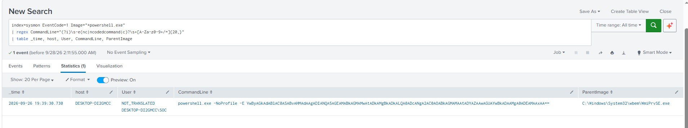

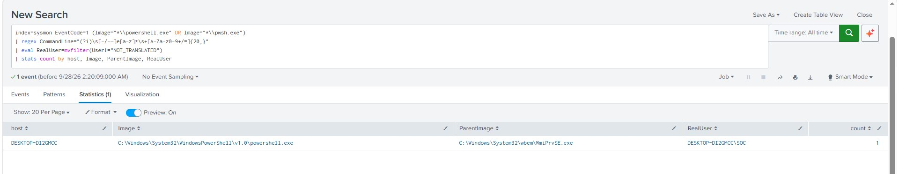

**Sigma version:** [`sigma_powershell_encoded_command.yml`](03_Detection_Engineering/Sigma_Rules/sigma_powershell_encoded_command.yml)

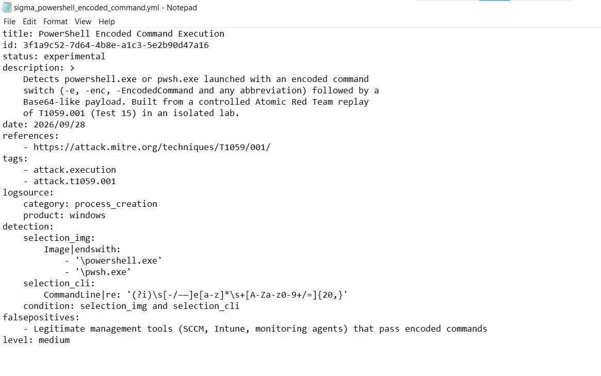

**Saved as a scheduled Splunk alert** (cron every 5 minutes, trigger when results > 0)

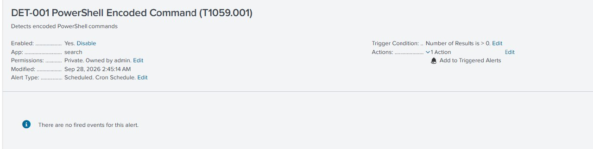

### DET-002: Scheduled Task with Logon Trigger and Highest Privileges (T1053.005)

```spl
index=wineventlog EventCode=4698
| regex TaskContent="(?i)<LogonTrigger>"
| regex TaskContent="(?i)<RunLevel>HighestAvailable</RunLevel>"
| table _time, host, Subject_Account_Name, Task_Name, TaskContent
```

**Rule test** and **false-positive check** against all 4698 events in the index:

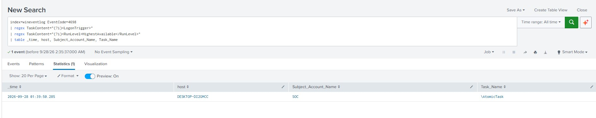

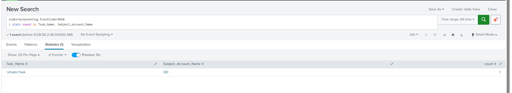

**Sigma version:** [`sigma_scheduled_task_logon_persistence.yml`](03_Detection_Engineering/Sigma_Rules/sigma_scheduled_task_logon_persistence.yml)

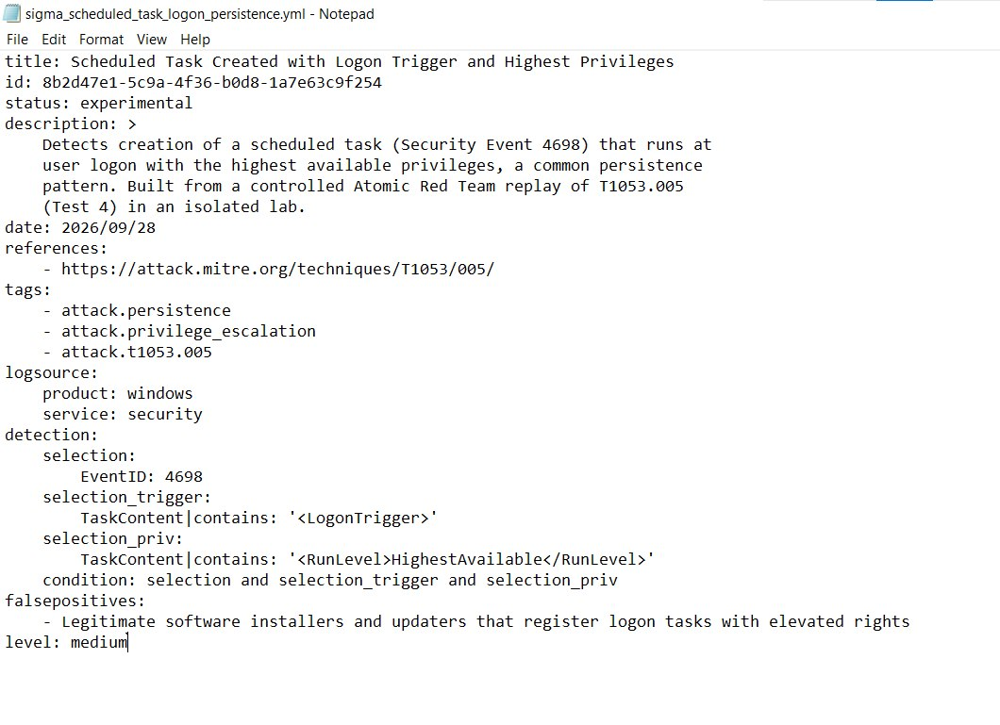

**Saved as a scheduled Splunk alert**

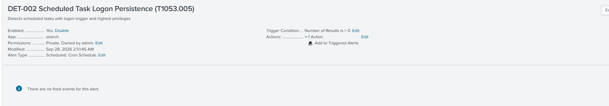

### Honest limitations

- The lab has almost no background activity, so **zero false positives here is weak evidence**. Real environments run SCCM, Intune and installers that legitimately use encoded commands and elevated logon tasks. Both rules need 1 to 2 weeks in monitor-only mode plus an allowlist before production.
- DET-002 depends on an audit policy that is not enabled by default.
- T1082 has no rule on purpose: `systeminfo.exe` alone is too common, so it is better handled with baselining/UEBA.

Full details: [`03_Detection_Engineering/02_Detection_Package.md`](03_Detection_Engineering/02_Detection_Package.md)

---

## Phase 4: Validation replay

Plan `RP-2026-09-29-001`: re-execute the same techniques after the rules exist and check that alerts fire.

### DET-001 replay

Replay executed at **01:43:55** (new `TestGuid` and a new Base64 payload):

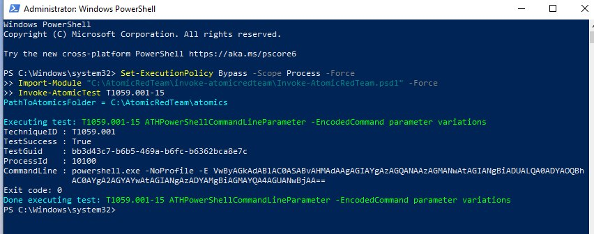

**Triggered Alerts:** DET-001 fired at **01:45:03**, about 70 seconds after the replay.

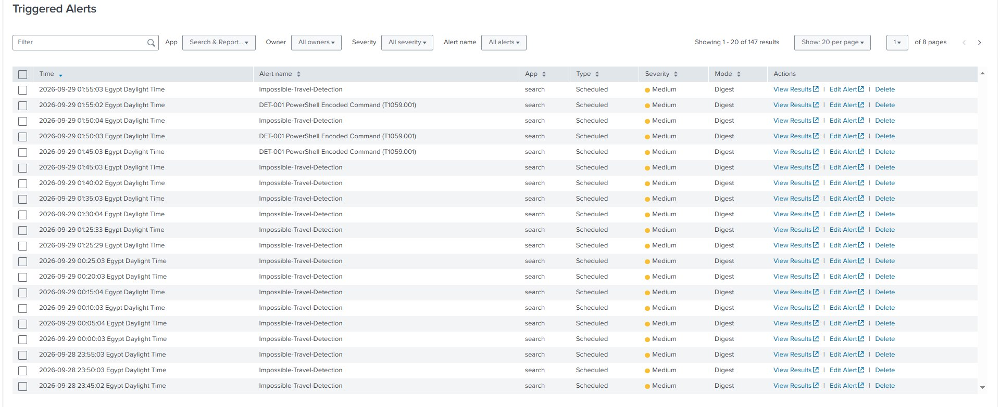

> **Tuning observation:** DET-001 fired three times (01:45:03, 01:50:03, 01:55:02) for this single event. The `-15m` search window is wider than the 5-minute schedule, so each run re-matches the same event until it ages out. A production version should use alert throttling or align the window with the schedule.

### DET-002 replay

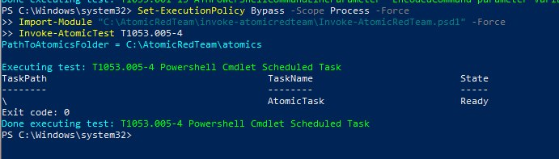

**Triggered Alerts:** DET-002 fired at **02:05:02**.

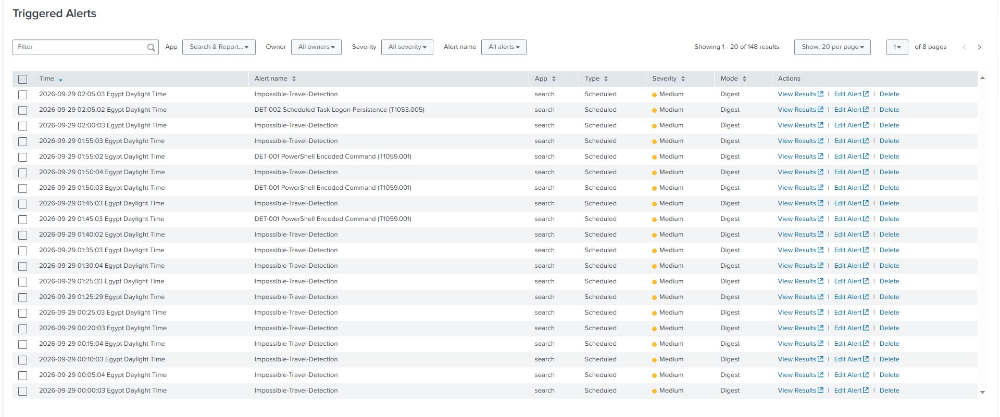

> The Triggered Alerts list also contains `Impossible-Travel-Detection`, a pre-existing alert from a different lab on the same Splunk instance. It is unrelated to this project.

### Post-validation cleanup

`AtomicTask` confirmed removed (empty `Get-ScheduledTask` result), and both alerts disabled to stop alerting on stale simulation data.

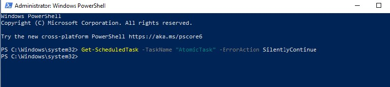

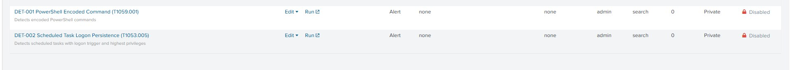

### Before and after

| | Before | After |
|---|---|---|
| Visibility | Partial (scheduled-task audit policy off) | Full for both techniques |
| Detection | No rule for any technique | 2 tested rules |
| Time to alert | Manual log review | Up to ~5 minutes (current schedule) |
| Documentation | None | Timeline, IOCs/TTPs, Sigma + SPL |

---

## 📁 Repository Structure

```text
.
├── README.md
├── 01_Setup_Evidence/              # telemetry check, Atomic setup, 3 simulated techniques (16 screenshots)
├── 02_DFIR_Investigation/
│   ├── 01_DFIR_Investigation_Report.md
│   ├── Timeline/Timeline.md
│   └── Screenshots/
├── 03_Detection_Engineering/
│   ├── 02_Detection_Package.md
│   ├── SPL_Rules/                  # DET-001, DET-002
│   ├── Sigma_Rules/                # portable Sigma versions
│   └── Screenshots/
├── 04_Validation_Replay/
│   ├── 03_Validation_Report.md
│   ├── Replay_Plan/Replay_Plan.md
│   ├── Alert_Evidence/
│   └── Before_After/
├── 05_Chain_of_Custody/
└── 06_Final_Deliverables/          # MITRE coverage map + executive summary
```

## Documents

| Document | Link |
|---|---|
| DFIR Investigation Report | [`01_DFIR_Investigation_Report.md`](02_DFIR_Investigation/01_DFIR_Investigation_Report.md) |
| Detection Package | [`02_Detection_Package.md`](03_Detection_Engineering/02_Detection_Package.md) |
| Validation Report | [`03_Validation_Report.md`](04_Validation_Replay/03_Validation_Report.md) |
| MITRE ATT&CK Coverage Map | [`04_MITRE_ATTACK_Coverage_Map.md`](06_Final_Deliverables/04_MITRE_ATTACK_Coverage_Map.md) |
| Chain of Custody | [`05_Chain_of_Custody.md`](05_Chain_of_Custody/05_Chain_of_Custody.md) |
| Executive Summary | [`06_Executive_Summary.md`](06_Final_Deliverables/06_Executive_Summary.md) |

## kills Demonstrated

`Splunk SPL` · `Sigma rules` · `Sysmon` · `Windows Event Logs (4698, 4103/4104)` · `Atomic Red Team` · `MITRE ATT&CK` · `DFIR timeline reconstruction` · `Detection tuning` · `Purple-team validation`

---

<div align="center">
<sub>Part of the <b>Resilient SOC</b> case file series · Lab activity only, no real-world victim data</sub>
</div>
